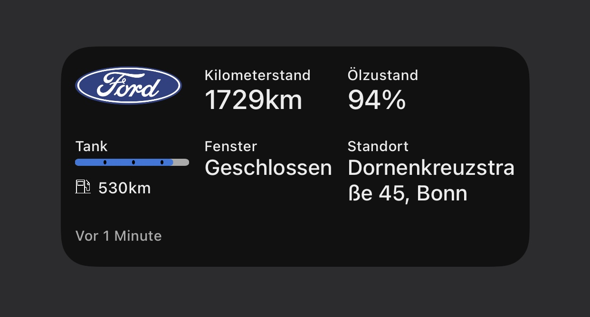

# FordPass widget for iOS Scriptable 

## Intro
This widget automatically fetches information about your ford car and displays them. The widget was tested on my own Ford Focus 2020 (EcoBoost 1.5) and with an iPhone 11 Pro Max.

## Requirements
- iOS 14
- [Scriptable App](https://scriptable.app/) (free)
- [FordPass account](https://sso.ci.ford.com/authsvc/mtfim/sps/authsvc?PolicyId=urn:ibm:security:authentication:asf:basicldapuser&Target=https%3A%2F%2Fsso.ci.ford.com%2Foidc%2Fendpoint%2Fdefault%2Fauthorize%3FqsId%3D1f0281db-c684-454a-8d31-0c0f297cc9ed%26client_id%3D880cf418-6345-4e3b-81cd-7b623309b571&identity_source_id=75d08ad1-510f-468a-b69b-5ebc34f773e3#appID=CCCA9FB8-B941-46AD-A89F-F9D9D699DD68&propertySpecificContentKey=brand_ford&originURL=https%3A%2F%2Fwww.ford.com%2F&lang=en_us&fsURL=https%3A%2F%2Fapi.mps.ford.com) (has to be working with FordPass app, NOT MyFord Mobile since this are two different systems)
- Compatible ford model (with FordPass Connect Modem equiped)

## Features
- Automatically fetch data from server (default every 5 minutes)
- Store data on local device as fallback 
- With a tap on the address Apple Maps (or Google Maps) will open and automatically pin the position of your car
- You can choose to store your credentials in a keychain (by default deactivated). After first successful run you can delete the credentials from the widget. But be careful: other widgets can also store and read data from the keychain!

new features:
- User can pick up to 6 elements to draw on widget
- New elements added

## BETA
Following elements are in beta tests:
- Doors
- Windows
- Lock status (upcoming version)
While the car is unlocked it sends periodically status updates to the servers. Depending on the frequency (unknown), it may happen that your car sends the "door is open" information to the server before you close it. If you lock your car right after this no further update may be sent to the server and the widgets shows that your door is open - even if it is closed. Sometimes my car is shown to be unlocked even though I´m sure that it is locked. Don´t rely on the information and be carefull!

## Todo
- Display information for electric cars (don´t have one so I can´t test it)
- Update function for widget

## Installation
- Press "raw" in the upper left corner and copy everything after opening the Ford.js script
- Open Scriptable App
- Press on "+" in the upper right corner and paste the code
- Insert your username, password of your Ford account and the VIN of your car (this information can be deleted after first successful run if keychain is used)
- Make any additional changes you want (colors, text size, indicators of fuel bar and name/color/symbol of widget inside Scriptable App)
- Go to your iOS homescreen and make a long press to enter "wiggle mode"
- Press "+" on the upper left corner and choose "Scriptable" as a medium sized widget
- Still in "wiggle mode" tap on the newly created widget and choose the Ford widget from the list under "Script"

## Notes
Don´t share your login data with anyone! With this information someone can read the status of your car of even control it!!

Don´t set the refresh interval too low. Too much requests to the ford server can block you temporarily. Additionally the data stored on the ford server is only updated while the ignition is on. Therefore you´ll get the same old data until you turn on your car. Furthermore too much requests can slow down the servers performance and increase the chance that the api is changed.

Use `clearKeychainOnNextRun` and `clearFileManagerOnNextRun` only if you are having trouble with the script. If both parameters are true, the auth_token and pictures are fetched everytime the script is executed. Once everything is working again, set both to `false`.

## Credits
Thanks to [d4v3y0rk](https://github.com/d4v3y0rk) for finding out the information about the ford api. Additional thanks to [marco79cgn](https://github.com/marco79cgn) and [Tobias Battenberg](https://github.com/mountbatt) for your widgets. They inspired me to create my own widget!

## Disclaimer
I have created this widget in my freetime. I don´t work for Ford nor do i get anything for creating this widget. The api can be changed anytime by Ford. Do not share this widget with your login data written in it. I am not liable for any kind of damage (special, direkt, indirekt, consequential or whatsoever) resulting from the use of this widget/script. Anybody who is in possesion of your data can control your car. 
